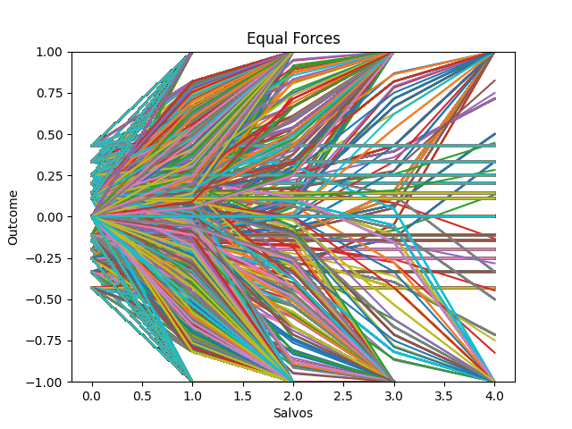
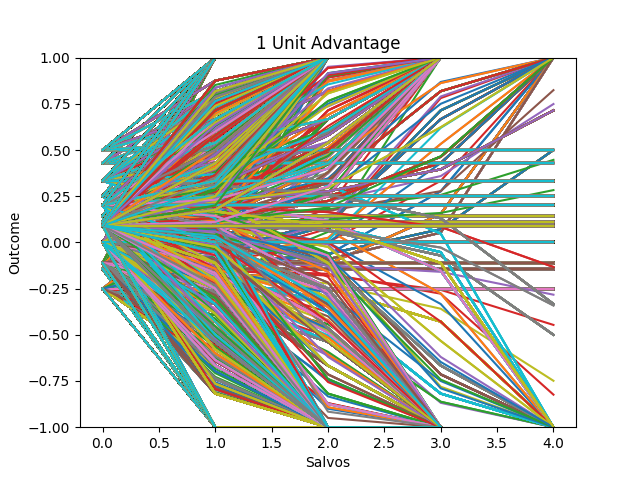
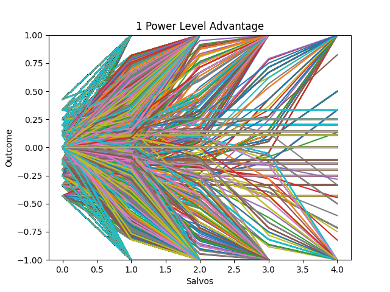
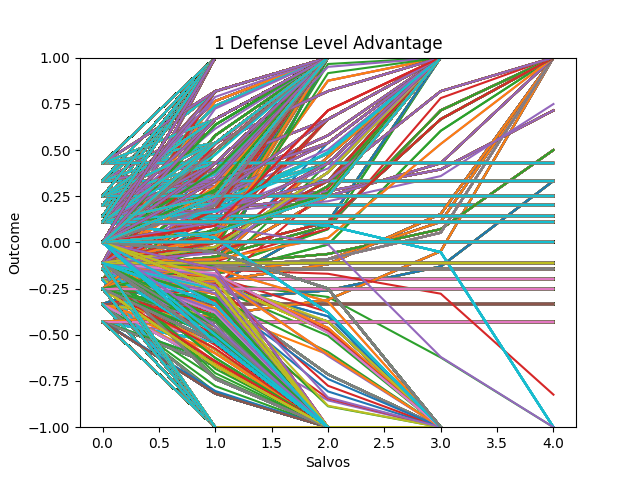
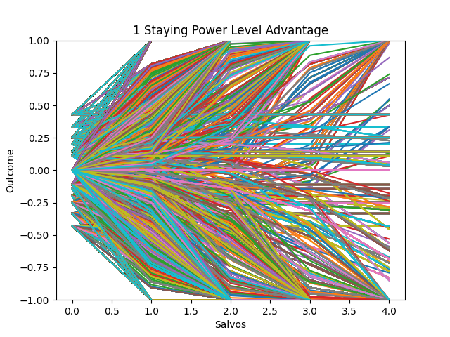
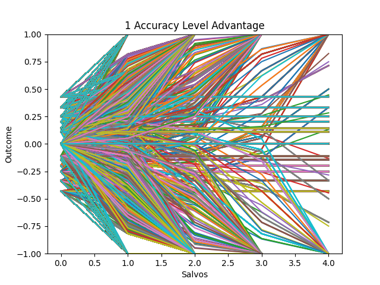
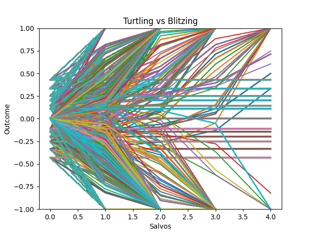
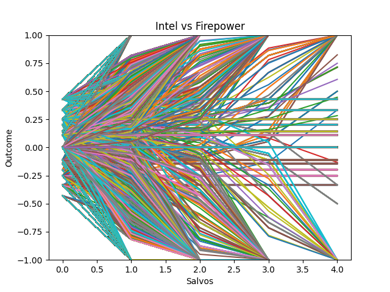

% LADE Differential Equations Project
% Aidan Glickman
% 2020-06-16

## Comparison of Combat Strategies Through Varied Stochastic Salvo Combat Models

### Scenario

When it comes to warfare, where should navies invest their money? Is it most important to have more ships? How about more powerful guns, better targeting systems or stronger armor? There are many considerations that go in to broad strategic planning, but the scope of this investigation will be limited to the implications of these differing strategies on direct military outcomes.

This investigation will consider several theoretical battles between two navies with differing advantages. Multiple simulations with normally distributed random differences in coefficient values will be used to construct a model through which to judge which strategy would come out on top in a battle between two belligerents of similar means with different resource allocation strategies.

### Background & Equations

In the traditional Salvo combat model, it is assumed that both parties have accurate targeting systems, allowing for all of its firepower to be effectively utilized during each combat phase. While this may have been a fine methodology in decades past when one could assume that any two belligerents would have an approximately equal chance of striking accurately, the more recent rise of information driven warfare means that some sort of measure of targeting capabilities is crucial to the integrity of the model. This is accomplished in our variant of the salvo combat model by adding variables to represent the relative accuracy of each force. 

Let's start by defining the terms of the standard (100% accuracy) salvo model. For two opposition forces A and B, the following table explains the meanings of the different variables:

| Meaning                       | A        | B       | Initial Value Bounds |
| ----------------------------- | -------- | ------- | -------- |
| Number of Units               | A        | B       | $[2, 6]$ |
| Attacking capability per unit | $\alpha$ | $\beta$ | $[1,4]$         |
| Defensive capability per unit | y        | z       | $[1,3]$         |
| Staying power per unit          | u        | v       |  $[1,2]$        |

Each of the bounds that we have defined for each variable come from an experiment carried out by Lucas & McGunnigle and will provide the basis for our analysis.

The following equations relate the variables in the table to define the losses suffered by each force after a single engagement.

$$\Delta B = -\frac{(\alpha A - z B)}{v} \text{ where } 0 \leq -\Delta B \leq B$$
$$\Delta A = -\frac{(\beta B - y A)}{u} \text{ where } 0 \leq -\Delta A \leq A$$

To modify these equations to account for accuracy, we can simply add one more variable to measure the probability of a hit.

| Meaning  | A        | B        | Initial Value Bounds |
| -------- | -------- | -------- | --- |
| $\ldots$ | $\ldots$ | $\ldots$ | ... |
| Accuracy | m        | n        | $(0.5, 1]$ |

Each of these new variables will act as a ratio bound between 0 and 1 that represents the probability of landing a hit by the that army when attacking.

$$
\begin{cases}
\frac{dB}{dt} = -\frac{(\alpha m A - z B)}{v} & \text{ where } 0 \leq -\frac{dB}{dt} \leq B \\
\frac{dA}{dt} = -\frac{(\beta n B - y A)}{u} & \text{ where } 0 \leq -\frac{dB}{dt} \leq A \\
\end{cases}
$$

Now the attacking power of each force is tempered by its accuracy, and we have a system of differential equations.

Now that we have the forms of our differential equations determined, we are ready to determine values and substitute them in. We will be simulating battles to consider different advantages and their bearing on outcomes.

Since we do not have definite values for these and would prefer some variance in our model to account for our uncertainty, we can carry out a Monte Carlo simulation. Adding in this variance will also help us account for the inherent uncertainty of simulating a system that is not in a controlled environment (like a naval engagement).

### Brief Intermission - Rationale for the Simulation

In each section of our simulation, we will consider different advantages and attempt to quantify their relative bearings on the outcome. This will be done by running our simulation with different advantages granted to each side on each iteration.

### Simulation

#### Introduction

First, we will provide a baseline of what several battles with no defined advantages would look like. This will also provide a template for what our analyses would look like. Our graphs will range from $-1$ to $1$ on the y axis, with positive values indicating advantage for Force 1 and negative values indicating advantage for Force 2. A line intersecting $y=1$ indicates a total victory for Force 1, with the converse true for Force 2.
This graph is for a total factorial simulation of all integer combinations (or decimals stepped by $0.1$ in the case of accuracy) of the bounds of each variable. The accompanying printout indicates some basic descriptive statistics about the the simulation.

{#fig:refname width=60%}

```
Engagements Simulated: 14400
Force1 Total Victories: 5020
Force2 Total Victories: 5020
Force1 Partial Victories: 1474
Force2 Partial Victories: 1474
Average Score: 0.0
```

As this simulation was run with no advantage granted to either side, we see that the number of victories is exactly equal, and our graph is symmetrical over $y=0$.

In each of the following simulations we will provide Force1 an advantage by shifting the bounds of one of its variables. Each simulation will be capped at a maximum of 5 salvo exchanges.

#### Example 1: Unit Advantage

When providing Force1 with a one unit advantage, we see a plot that visually looks similar to our base plot, but shifted up slightly.

{#fig:refname width=60%}

```
Engagements Simulated: 14400
Force1 Total Victories: 7155
Force2 Total Victories: 2959
Force1 Partial Victories: 2264
Force2 Partial Victories: 944
Average Score: 0.5454545454545454
```

This shows a reasonably large advantage from just having one extra ship.

#### Example 2: Power Advantage

When Force 1 has a one power level advantage, we see an interesting shift in our outcomes. While the average score difference is less extreme than with a one unit advantage, a larger proportion of battles are total victories in Force 1's favor. 

{#fig:refname width=60%}

```
Engagements Simulated: 14400
Force1 Total Victories: 7825
Force2 Total Victories: 4145
Force1 Partial Victories: 435
Force2 Partial Victories: 1039
Average Score: 0.5
```

In these cases Force 1, in battles where it has an advantage, has a heightened ability to destroy Force 2 fully before the time limit expires, leading to a higher proportion of total victories.

#### Example 3: One Defense Level Advantage

While a one defense level advantage yields a higher average score than a one power level advantage, it achieves this benefit in a much different way. The number of total victories for Force 1 is much lower than in the case of a power level advantage but the number of total victories for Force2 is diminished by an even greater degree.

{#fig:refname width=60%}

```
Engagements Simulated: 14400
Force1 Total Victories: 5616
Force2 Total Victories: 2288
Force1 Partial Victories: 1893
Force2 Partial Victories: 2641
Average Score: 0.5128205128205127
```

Since Force 1 has a much greater capability to intercept missiles launched by Force 2, it can last much longer in a battle, meaning that even in cases where it is at a disadvantage it can avoid being completely wiped out.

#### Example 4: 1 Staying Power Level Advantage

In this case, an advantage in staying power simply provides a more tempered version of the benefits of greater defense. In a more complex model (perhaps one where the attacking capabilities of ships are diminished as they are damaged) staying power may have a different effect from defense, but in this model that is not the case.

{#fig:refname width=60%}

```
Engagements Simulated: 14400
Force1 Total Victories: 5337
Force2 Total Victories: 3982
Force1 Partial Victories: 1573
Force2 Partial Victories: 2202
Average Score: 0.45614035087719285
```

#### Example 5: 1 Accuracy Level (0.1 Accuracy) Advantage

An advantage by one accuracy level has a very interesting effect on the battle. Even though accuracy is essentially another term for the power variable, it has a much different effect on the simulation. Even though the raw difference in the numbers of victories between the two sides is not very extreme, we see a huge bump in the average score advantage, indicating that many of the partial victories were severely in favor of Force 1.

{#fig:refname width=60%}

```
Engagements Simulated: 14400
Force1 Total Victories: 5813
Force2 Total Victories: 4789
Force1 Partial Victories: 1154
Force2 Partial Victories: 1347
Average Score: 0.6666666666666659
```

By examining the graph, we can see that there are many battles that reach an equilibrium with advantages for Force 1 that don't ever make it to a total victory, and this is where the bulk of our score difference lies.

### Comparison of Advantages

Now that we have seen the base impacts that differing advantages have, we can examine how these advantages interact when pitted against eachother.

#### Test 1: Turtling vs Blitzing (Defense vs Attack)

One of the most common (and most infuriating) strategies in Real Time Strategy video games is "Turtling," or placing a high emphasis on defensive power to outlast an opponent to the end game. In this simulation, Force 1 will have a 1 defense level advantage, and Force 2 will have a 1 attack level advantage.

{#fig:refname width=60%}

```
Engagements Simulated: 14400
Force1 Total Victories: 5208
Force2 Total Victories: 4606
Force1 Partial Victories: 1717
Force2 Partial Victories: 1298
Average Score: 0.38095238095238076
```

In this simulation, we find that better defense does generally win out over better attack over many battles, but there are some interesting observations to make. As seen in the graph, many of Force 1 (the "turtle")'s victories were won late on, often ending in 3 or 4 salvos while Force 2 (the "attacker")'s victories coming earlier at 1 or 2 exchanges.

#### Test 2: Intel vs Firepower (Accuracy vs Power)

This simulation will determine whether it is better to invest in stronger weapons or better targeting systems, by simulating a battle between Force 1, who will have an accuracy advantage, and Force 2, who will have a power advantage.

{#fig:refname width=60%}

```
Engagements Simulated: 14400
Force1 Total Victories: 4770
Force2 Total Victories: 7453
Force1 Partial Victories: 813
Force2 Partial Victories: 383
Average Score: -0.5
```

While the readout here would suggest a resounding victory for increased firepower, in truth this simulation is essentially the same as if we gave both sides unequal power advantages, as power and accuracy are ultimately multiplied together. The only way to get an accurate handle on these two statistics would be quantify what the cost to increase each of these coefficients would be and work from there.

### Conclusion

Through these various simulations, we found that advantages in different areas can have starkly different effects on the outcomes of battles. There are a multitude more tests that could be carried out using this model and this simulation framework, but this small sampling has already proven the importance of different strategies.

This model could definitely be improved and expanded upon. Increased complexity could give a better idea of how these differing advantages interact (as seen here with the Intel vs Firepower simulation). This increased complexity could come at the cost of longer simulation times, as discussed in Lucas & McGunnigle's paper.

Overall, this has provided some interesting insights in to the importance of different aspects of naval warfare, and the results of these simulations seem to have clear and obvious real world analogues, which is an encouraging indication with regards to the realism of the model.

## Sources

- Armstrong, Michael J. “A Stochastic Salvo Model for Naval Surface Combat.” Operations Research, vol. 53, no. 5, 2005, pp. 830–841.
  - Some of the strategies in this paper will be used to consider how to deal with accuracy. While the equations here deal with area fire, I used them to gain a better idea of how to effectively modify salvo with coefficients that won't overpower the base ones.
- Armstrong, Michael J. “A Stochastic Salvo Model for Naval Surface Combat.” Operations Research, vol. 53, no. 5, 2005, pp. 830–841.
  - Some of the strategies in this paper will be used to consider how to implement random variation in to our model to allow for multiple simulations and a get a better idea of which strategy will prevail. Ended up being used mostly as a way to understand what sort of variances are appropriate for this type of model rather than informing the method used to make the model stochastic.
- Haug, Kevin. (2004). Using Hughes' Salvo Model to Examine Ship Characteristics in Surface Warfare. 82. 
  - This paper provides a great framework for analyzing Salvo warfare and also lays out good parameters for bounds on each of the coefficients.
- Lucas, T. W., & McGunnigle, J. E. (2003). When is model complexity too much? Illustrating the benefits of simple models with Hughes’ salvo equations. Naval Research Logistics, 50(3), 197–217.
	- This paper provides a great analysis of the traditional Salvo Warfare model, which much of my testing is based on.
